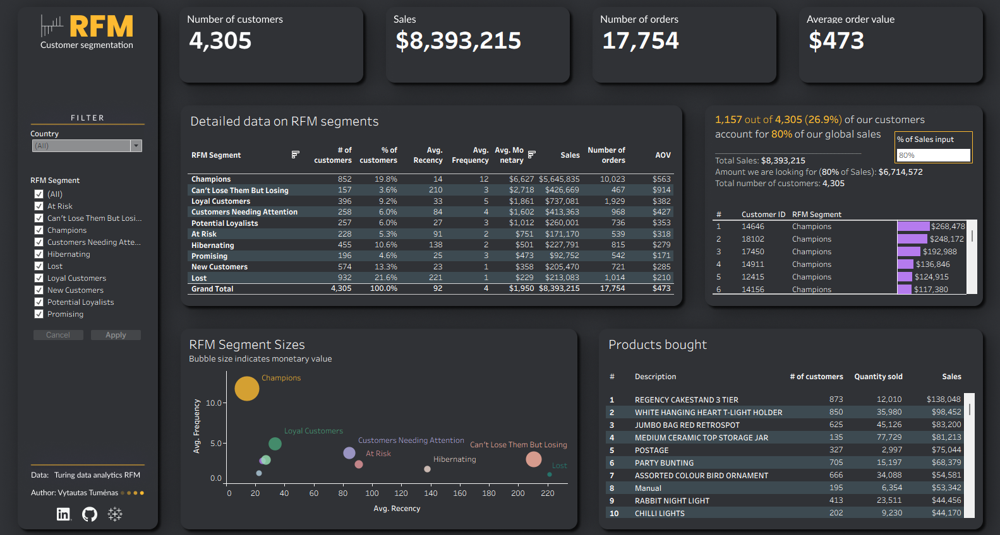
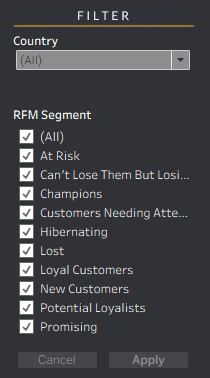
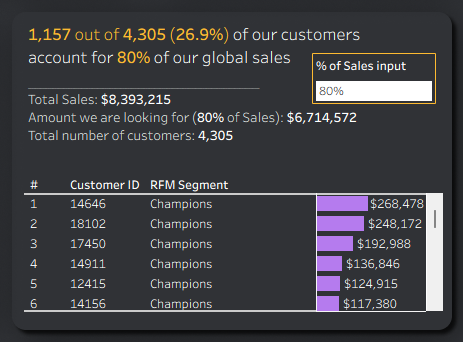
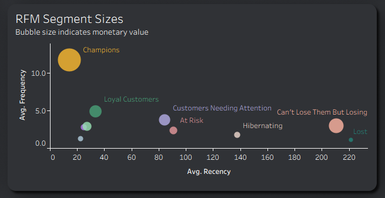
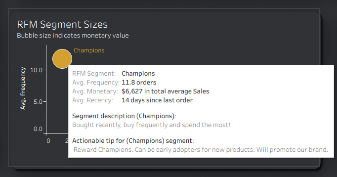

# RFM analysis


An interactive dashboard that uses RFM analysis to segment customers into actionable groups, enabling targeted marketing strategies to boost retention and sales.

## 🔗 Quick Links

* ➡️ [**View the Interactive Dashboard on Tableau Public**](https://public.tableau.com/app/profile/vytautas.tu/viz/rfm-dashboard/RFMDashboard)
* 💼 **[Explore my Full Tableau Portfolio](https://public.tableau.com/app/profile/vytautas.tu)**

## 🎯 Business Problem & Objectives

In a competitive market, treating all customers the same is inefficient and costly. The key to sustainable growth is understanding who your best customers are and tailoring marketing efforts accordingly. This project was designed to solve this challenge by moving away from mass marketing towards a more targeted, data-driven approach.

The primary objectives were:

- **Identify High-Value Customers**: Pinpoint the most profitable customer segments that drive the majority of revenue.
- **Enable Targeted Marketing**: Create distinct customer segments based on purchasing behavior to allow for personalized marketing campaigns.
- **Improve Customer Retention**: Identify at-risk and hibernating customers to launch proactive retention and reactivation campaigns.
- **Optimize Marketing Spend**: Increase marketing ROI by focusing resources on the most responsive and valuable customer segments.

---

<br>



<br>

## ✨ Project Overview

This project implements **RFM (Recency, Frequency, Monetary)** analysis, a powerful marketing technique used to segment customers based on their transaction history. The final deliverable is an interactive Tableau dashboard that provides a comprehensive, at-a-glance view of the entire customer base, broken down into 10 distinct RFM segments.

The dashboard allows stakeholders to:
- **Visualize the Customer Landscape**: See the size and monetary value of each customer segment.
- **Drill Down into Segments**: Filter the entire dashboard to analyze the behavior of specific groups like "Champions" or "At-Risk" customers.
- **Identify Top Products**: Discover which products are most popular among the highest-value customer segments.

## 🛠️ Key Features & Functionality
- **Interactive Segment Analysis**: Dynamic filters for Country and RFM Segment allow for a deep dive into specific customer groups. Selecting a segment dynamically updates the entire dashboard, revealing the top products purchased by that group.



- **Customer Value (Pareto) Analysis**: The dashboard includes a powerful Pareto insight, demonstrating that a minority of customers—just 26.9% of the customer base—drives the vast majority of revenue, accounting for 80% of all sales.



- **RFM Visualization**: A bubble chart effectively visualizes the size and value of each RFM segment, plotting Average Recency against Average Frequency, with the bubble size representing the monetary value of each group.



- **Actionable Tooltips**: To bridge the gap between analysis and action, hovering over any segment in the bubble chart reveals a detailed tooltip. This includes not only key metrics but also a qualitative description of the segment and a recommended marketing tip, providing instant strategic guidance.
  


---

## 💡 Key Insights & Findings

The RFM analysis revealed several critical insights, leading to clear, data-driven marketing strategies for each key segment.

**The Pareto Principle in Action: Your "Champions"**

- **Insight:** The top customer segment, the "Champions", represents just **~20% of the customer base (852 customers)** but is responsible for a staggering **67% of total sales ($5.6M)**.

- **Strategy:** These are your most valuable customers.
  -  **Reward Them:** Launch an exclusive loyalty program or offer early access to new products.
  -  **Leverage Their Voice:** Encourage them to become brand advocates through reviews and testimonials.
  -  **Keep Them Engaged:** Send personalized thank-you notes and special offers to maintain their loyalty.

**The High-Potential Segments**: "Loyal Customers" & "Potential Loyalists"

- **Insight**: These two groups are frequent buyers who represent a significant portion of the customer base but have a lower monetary spend than Champions.

- **Strategy**: Nurture these customers to increase their monetary value.
  - **Upsell & Cross-sell**: Recommend higher-value products or complementary items based on their purchase history.
  - **Engage with Promotions**: Offer targeted discounts or bundle deals to encourage larger purchases.

**The Lost Customers**
- **Insight**: The "Lost" segment is the largest by customer count (**~22% of the customer base - 932 customers**) but has the lowest frequency, and monetary value with longest recency.

- **Strategy**: While it's difficult to re-engage this group, a low-cost, automated campaign can still be effective.

  - **Win-Back Campaign**: Send one final, high-value offer to try and win them back.

  - **Learn from Them**: Analyze their past purchase history to understand potential reasons for churn and improve the experience for current customers.


## 🗄️ Methodology

The core of this project is the calculation of RFM scores, which was performed entirely in SQL. The methodology follows a clear, step-by-step process:

1. **Calculate R, F, and M Values**: First, each customer's **Recency** (days since last purchase), **Frequency** (total number of transactions), and **Monetary** (total sales value) were calculated from the raw transaction data.

2. **Score Customers by Quartile**: Customers were then scored on a scale of 1 to 4 for each of the three metrics based on which quartile they fell into. For example, the top 25% of spenders received a Monetary score of 4.

3. **Define RFM Segments**: Finally, customers were assigned to one of 10 distinct segments. This was done by first establishing clear business definitions for each segment (e.g., 'Champions' are recent, frequent, high-spending customers). Then, every possible combination of R, F, and M scores was logically assessed and mapped to the most appropriate segment.


### SQL code

```sql

WITH
-- Create date parameters
date_param AS (
    SELECT
      TIMESTAMP('2010-12-01 00:00:00', 'UTC') AS start_date,
      TIMESTAMP('2011-12-01 00:00:00', 'UTC') AS end_date,
      TIMESTAMP('2011-12-01 00:00:00', 'UTC') AS reference_date
),

-- Compute for F & M
t1 AS (
    SELECT
      ROW_NUMBER() OVER() cust_id_new, -- There are several customers with a different country on the same customer_id
      CustomerID as customer_id,
      country,
      DATE(MAX(InvoiceDate)) AS last_purchase_date,
      COUNT(DISTINCT InvoiceNo) AS frequency,
      ROUND(SUM(Quantity * UnitPrice), 2) AS monetary
    FROM `tc-da-1.turing_data_analytics.rfm` rfm, date_param
    WHERE 1=1
      AND CustomerID IS NOT NULL
      AND InvoiceDate BETWEEN start_date AND end_date
      AND UnitPrice >= 0.01
      AND Quantity >= 1
    GROUP BY CustomerID, Country
),

-- Compute for R
t2 AS (
    SELECT 
      t1.*,
      DATE_DIFF(DATE(reference_date), last_purchase_date, DAY) AS recency
    FROM t1, date_param
),

-- Determine quartiles for RFM
t3 AS (
    SELECT 
       APPROX_QUANTILES(recency, 100)[OFFSET(25)] AS r25
      ,APPROX_QUANTILES(recency, 100)[OFFSET(50)] AS r50
      ,APPROX_QUANTILES(recency, 100)[OFFSET(75)] AS r75
      ,APPROX_QUANTILES(recency, 100)[OFFSET(100)] AS r100
      ,APPROX_QUANTILES(frequency, 100)[OFFSET(25)] AS f25
      ,APPROX_QUANTILES(frequency, 100)[OFFSET(50)] AS f50
      ,APPROX_QUANTILES(frequency, 100)[OFFSET(75)] AS f75
      ,APPROX_QUANTILES(frequency, 100)[OFFSET(100)] AS f100
      ,APPROX_QUANTILES(monetary, 100)[OFFSET(25)] AS m25
      ,APPROX_QUANTILES(monetary, 100)[OFFSET(50)] AS m50
      ,APPROX_QUANTILES(monetary, 100)[OFFSET(75)] AS m75
      ,APPROX_QUANTILES(monetary, 100)[OFFSET(100)] AS m100
    FROM t2
),

-- Assign scores for R F M
t4 AS (
    SELECT
      t2.*,
      CASE 
        WHEN monetary <= m25 THEN 1
        WHEN monetary <= m50 AND monetary > m25 THEN 2 
        WHEN monetary <= m75 AND monetary > m50 THEN 3 
        ELSE 4 
      END AS m_score,
      CASE 
        WHEN frequency <= f25 THEN 1
        WHEN frequency <= f50 AND frequency > f25 THEN 2 
        WHEN frequency <= f75 AND frequency > f50 THEN 3 
        ELSE 4 
      END AS f_score,
      CASE 
        WHEN recency <= r25 THEN 4
        WHEN recency <= r50 AND recency > r25 THEN 3 
        WHEN recency <= r75 AND recency > r50 THEN 2 
        ELSE 1 
      END AS r_score,
    FROM t2, t3
),

-- Concatinate r, f & m scores
t5 AS (
    SELECT *,
      CONCAT(r_score, f_score, m_score) AS rfm
    FROM t4  
),

-- Define RFM segments
t6 AS (
    SELECT
      t5.*,
      CASE 
        WHEN rfm IN ('444', '344', '434', '443') THEN 'Champions' 
        WHEN rfm IN ('244', '334', '343', '424', '433', '442', '324') THEN 'Loyal Customers' 
        WHEN rfm IN ('333', '342', '423', '441', '323') THEN 'Potential Loyalist' 
        WHEN rfm IN ('414', '413', '422', '314', '313', '412', '421', '312', '411', '321', '311') THEN 'New Customers' 
        WHEN rfm IN ('432', '332', '341', '431', '322', '331') THEN 'Promising'
        WHEN rfm IN ('243', '234', '224', '233') THEN 'Customers Needing Attention'
        WHEN rfm IN ('242', '142', '223', '232', '241', '141', '213', '231') THEN 'At Risk'
        WHEN rfm IN ('144', '134', '143', '124', '133', '214', '114', '113') THEN "Can't Lose Them But Losing"
        WHEN rfm IN ('123', '132', '222', '122', '212', '221') THEN 'Hibernating'
        WHEN rfm IN ('131', '112', '121', '211', '111') THEN 'Lost' 
      END AS rfm_segment 
    FROM t5
)

SELECT * FROM t6
```

---


##  🎨 Dashboard Design Philosophy
The design of this dashboard was guided by the principle of "clarity at a glance." The goal was to create a tool that allows a stakeholder to immediately understand the customer landscape and identify key segments without needing to interpret complex charts.

- **Layout & Hierarchy**: A top-down layout was used to guide the user's eye. High-level KPIs are placed at the top for an immediate summary, followed by a detailed breakdown in the center. The filter panel is placed on the left, following a natural reading order.
- **Color Palette**: A modern dark theme ensures the data visualizations have high contrast and are easy to read. A specific, high-energy accent color (yellow) is used strategically to highlight the most valuable "Champions" segment, ensuring the most important insight is also the most visible.


## 💻 Tech Stack

* **Database:** Google BigQuery
* **Data Extraction & Transformation (ETL):** SQL, Excel
* **Data Visualization & BI:** Tableau
* **Design** Figma
* **Version Control:** Git & GitHub

